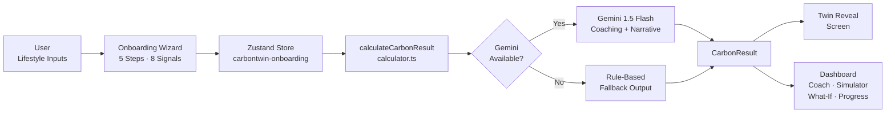
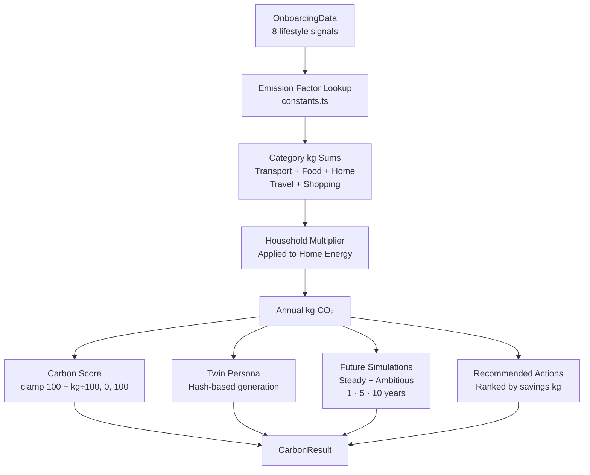

# CarbonTwin AI — Architecture

This document describes the component architecture, data flows, state management, and AI integration patterns of CarbonTwin AI.

---

## System Overview

CarbonTwin AI is a **client-only Single Page Application**. The entire carbon calculation pipeline, twin generation, simulation engine, and coaching logic runs synchronously in the user's browser. Google Gemini AI is an optional enrichment layer; the product works at 100% without it.

```
┌─────────────────────────────────────────────────────────┐
│                    User's Browser                       │
│                                                         │
│  ┌─────────┐    ┌────────────┐    ┌──────────────────┐ │
│  │Onboarding│───▶│Carbon Engine│───▶│  Dashboard UI    │ │
│  │ Wizard  │    │(client-side)│    │  (React/Recharts)│ │
│  └─────────┘    └────────────┘    └──────────────────┘ │
│       │               │                    │            │
│       ▼               ▼                    ▼            │
│  ┌─────────────────────────────────────────────────┐   │
│  │           Zustand Persist Store (v2)            │   │
│  │           localStorage: carbontwin-onboarding   │   │
│  └─────────────────────────────────────────────────┘   │
└─────────────────────────────────────────────────────────┘
                         │
                         │ Optional (VITE_GEMINI_API_KEY)
                         ▼
               ┌─────────────────┐
               │ Google Gemini   │
               │ 1.5 Flash API   │
               └─────────────────┘
```

---

## Component Architecture

### Route Structure (Wouter)

```
/                          → Landing page (marketing)
/onboarding                → Onboarding wizard entry
/onboarding/reveal         → Twin reveal screen
/dashboard                 → Dashboard overview
/dashboard/coach           → AI coaching page
/dashboard/simulator       → Future simulation charts
/dashboard/what-if         → What-if scenario builder
/dashboard/progress        → Progress tracking
```

### Component Tree

```
App
├── Landing Page
│   ├── HeroSection          (animated Carbon Twin preview)
│   ├── FeaturesSection      (feature cards)
│   ├── HowItWorksSection    (3-step explainer)
│   └── CTASection           (call to action)
│
├── Onboarding Wizard
│   ├── WizardShell          (step header, progress bar)
│   ├── StepTransport        (option cards: car/transit/bike/walk/mixed)
│   ├── StepDiet             (option cards: meat-heavy/balanced/vegetarian/vegan)
│   ├── StepHomeEnergy       (option cards: low/medium/high)
│   ├── StepHousehold        (option cards: solo/couple/family)
│   ├── StepPersonalise      (name input + motivation selection)
│   └── LiveFootprintPreview (real-time estimate sidebar)
│
├── Twin Reveal
│   ├── AvatarReveal         (Framer Motion sequence animation)
│   ├── ScoreDisplay         (Carbon Score ring)
│   ├── TwinProfile          (name + archetype + traits)
│   └── TopActions           (top 3 recommended actions)
│
└── Dashboard
    ├── DashboardNav         (tab navigation)
    ├── CoachPage
    │   ├── InsightCards     (coaching tone cards)
    │   └── GeminiCoach      (AI-enriched message)
    ├── SimulatorPage
    │   ├── ScenarioSelector (steady/ambitious toggle)
    │   └── ProjectionChart  (Recharts area chart)
    ├── WhatIfPage
    │   ├── HypotheticalForm (lifestyle change inputs)
    │   └── NarrativeOutput  (Gemini/rule-based response)
    └── ProgressPage
        ├── ScoreHistory     (timeline chart)
        └── MilestoneTracker (badges)
```

---

## Data Flow

### Onboarding → Carbon Result



### Carbon Calculation Pipeline



### Live Preview (Partial Estimate)

During onboarding, `calculatePartialCarbonEstimate` runs on every input change. Missing fields are filled with category-level defaults from `DEFAULT_BREAKDOWN`, so the preview shows a realistic estimate at every step rather than an inaccurate partial sum.

```
Step 1 answered → confidence: 12.5% → transport filled, 4 defaults used
Step 2 answered → confidence: 25%   → transport + diet filled, 3 defaults
...
Step 5 answered → confidence: 100%  → all 8 signals confirmed
```

---

## State Management

### Zustand Store Schema (v2)

```typescript
interface OnboardingStore {
  // Persisted
  step: number;                      // Current wizard step [1–5]
  data: Partial<OnboardingData>;     // Collected lifestyle signals
  result: CarbonResult | null;       // Full calculation result (post-reveal)

  // Runtime only (not persisted)
  hasHydrated: boolean;              // localStorage hydration complete flag

  // Actions
  setStep(step: number): void;
  updateData(partial: Partial<OnboardingData>): void;
  setResult(result: CarbonResult): void;
  reset(): void;
  setHasHydrated(v: boolean): void;
}
```

### Persistence Contract

- Storage key: `carbontwin-onboarding`
- Schema version: `2`
- Migration: clamps `step` to `[1, 5]`, clears stale `result` from v1
- Persisted fields: `step`, `data`, `result`
- Non-persisted: `hasHydrated` (always `false` on module load, set to `true` after hydration)

---

## AI Integration

### Dual-Path Architecture

Every AI-powered feature has a complete rule-based fallback. Gemini is never in the critical path.

```
Feature Request
      │
      ▼
isGeminiAvailable()?
      │
   ┌──┴──┐
  Yes    No
   │      │
   ▼      ▼
Gemini  Rule-Based
Call    Output
   │      │
   └──┬───┘
      ▼
  Feature Output
  (identical shape)
```

### Prompt Engineering

Both Gemini prompts use structured output to ensure parseable, validatable responses:

**Coaching (`generateCarbonCoachMessage`)**
- System role: warm sustainability coach
- Output: JSON `{ message, topTip, encouragement }`
- Validation: JSON regex extraction + required field check
- Fallback: throw → caller renders rule-based coaching cards

**What-If (`generateWhatIfScenario`)**
- Output: 2 sentences (plain text, no JSON)
- Sentence 1: quantified CO₂ impact estimate
- Sentence 2: most important real-world first step

### Model Configuration

```typescript
model: "gemini-1.5-flash",
generationConfig: {
  temperature: 0.7,   // Balanced creativity vs. consistency
  topP: 0.9,          // Nucleus sampling for natural output
  maxOutputTokens: 1024,  // Sufficient for structured JSON responses
}
```

---

## Module Dependency Graph

```
types.ts          ← no imports (pure type definitions)
constants.ts      ← types.ts
math.ts           ← types.ts
simulation.ts     ← constants.ts · math.ts · types.ts
assistant.ts      ← constants.ts · math.ts · types.ts
calculator.ts     ← constants.ts · math.ts · simulation.ts · assistant.ts · types.ts
gemini/client.ts  ← constants.ts · math.ts · types.ts
```

The carbon engine has **no circular dependencies**. `types.ts` is the root; `calculator.ts` is the only entry point for callers.

---

## Error Handling Strategy

| Layer | Errors | Strategy |
|-------|--------|---------|
| Carbon engine | Type mismatches, missing fields | TypeScript prevents at compile time |
| Partial estimate | Missing onboarding fields | Defaults substituted silently |
| Gemini API | Network failures, malformed JSON | `throw` → caller falls back to rule-based |
| Zustand persist | Stale schema (v1 data) | `migrate` function normalises on hydration |
| Name validation | Invalid characters, length violations | `sanitizeNameInput` + `validateDisplayName` return error strings |
